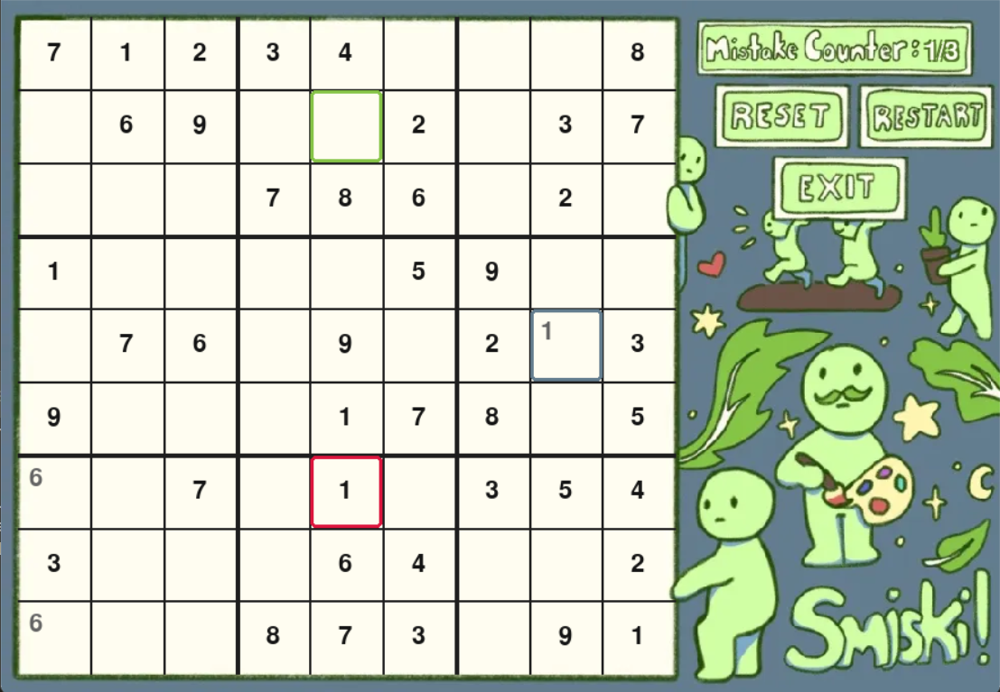

# Smiski Sudoku 🧩

A charming Smiski-themed Sudoku game built with Pygame. Challenge yourself with this classic number puzzle game featuring adorable Smiski characters!

## Features

- 🎮 Three difficulty levels: Easy, Medium, and Hard
- 🎨 Cute Smiski-themed interface and backgrounds
- ✏️ Sketch mode for trying numbers before committing
- ❌ Three-strikes system for incorrect answers
- 🔄 Reset and restart functionality

## Controls

- **Mouse**: Click cells and buttons to interact
- **Number Keys (1-9)**: Sketch a number in the selected cell
- **Enter/Return**: Confirm sketched number
- **Backspace**: Clear sketched number
- **Arrow Keys**: Navigate between cells

## Installation

1. Ensure you have Python 3.10 installed
2. Install the required dependency:

```bash
pip install pygame
```

3. Clone this repository:

```bash
git clone https://github.com/karmaaka5477/Sudoku-Project.git
```

4. Run this game:

```bash
python sudoku.py
```

## How to Play

1. Select your preferred difficulty level from the main menu
2. Click a cell or use arrow keys to navigate
3. Use number keys to sketch numbers in empty cells
4. Press Enter to confirm your number
5. Complete the puzzle without making three mistakes!

## Game Rules

- Each row must contain numbers 1-9 without repetition
- Each column must contain numbers 1-9 without repetition
- Each 3x3 box must contain numbers 1-9 without repetition
- Three incorrect placements result in game over

## Screenshots




## Credits

- Smiski characters and theme
- Built with Pygame
- Created by The Goats 🐐 (Sagan, Paulina, and Supreet)